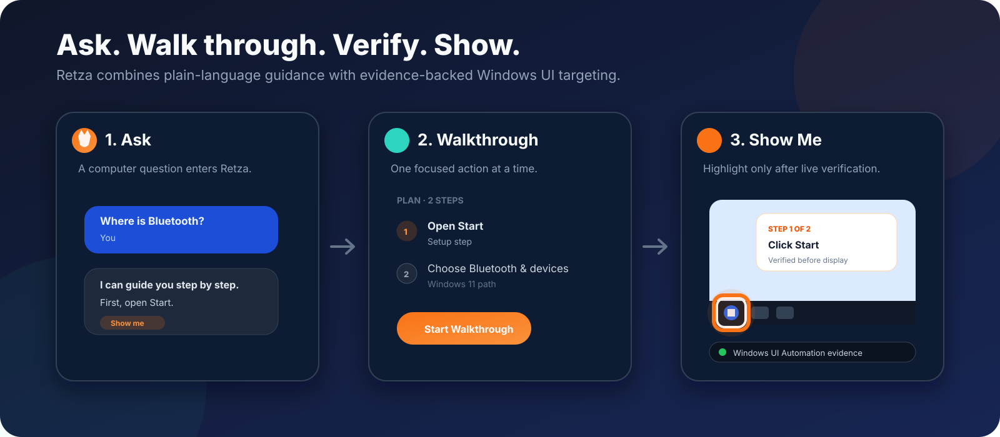

# Retza

**Reaching Everybody Through Zero Barrier Accessibility**

A Windows-first desktop accessibility assistant that turns computer questions into plain-language walkthroughs, proactive support, and verified on-screen guidance.

`Electron` · `TypeScript` · `React` · `Gemini` · `Windows UI Automation` · `Vitest`

<p align="center">
  <strong><a href="https://retza-live-demo.vercel.app/">Try the live browser demo</a></strong>
</p>

<p align="center">
  
</p>

Retza started from a simple usability question: **what happens when computer help assumes knowledge the user does not have?**

Early versions focused on shorter AI instructions and a deliberately simple interface. Testing exposed a more important failure. A person could understand an instruction and still be unable to find the control it described. That observation changed the project from a text helper into a guided accessibility system built around one-step walkthroughs, visual guidance, conservative proactive support, and explicit trust boundaries around AI output.

> **Core engineering principle:** if Retza cannot confidently verify where a control is, it does not point.

<p align="center">
  <a href="#project-snapshot">Snapshot</a> ·
  <a href="#show-me-in-action">Show Me</a> ·
  <a href="#my-contribution">My contribution</a> ·
  <a href="#from-user-feedback-to-product-decisions">Iteration</a> ·
  <a href="#engineering-the-show-me-system">Engineering</a> ·
  <a href="#testing-and-reliability">Testing</a> ·
  <a href="#run-locally">Run locally</a>
</p>

## Project snapshot

| Area | What Retza demonstrates |
| --- | --- |
| **Problem** | Computer help often assumes vocabulary, interface knowledge, and confidence that less experienced users may not have |
| **Product** | A Windows-first assistant for plain-language questions, step-by-step walkthroughs, proactive help, and visual guidance |
| **Technical centerpiece** | Fail-closed Show Me targeting through Windows UI Automation rather than model-generated screen coordinates |
| **Guidance strategy** | Deterministic Windows navigation for stable tasks, Gemini for broader questions, and prerequisite repair when setup steps are missing |
| **User-centered iteration** | Testing showed that understandable wording can still fail when the user cannot locate the next control |
| **My contribution** | Target-user research, difficult-task and example selection, testing and feedback interpretation, product framing, and project communication |
| **Team** | Michael Tetelbaum, Vladimir Dukkardt, Algasem Zabarah, and Kevin Zhu |
| **Verification** | 103 desktop Vitest tests across six test files, 10 focused browser Node tests, local browser regressions, production smoke checks, type checking, and production builds |

## Show Me in action

<p align="center">
  
</p>

The animation above captures the idea that most clearly represents Retza's evolution. A walkthrough step can expose **Show Me**, which describes the intended control semantically, resolves that control against the live Windows accessibility tree, validates the match, converts its geometry safely, and displays guidance only when the result is trustworthy enough.

The key usability insight was simple: **knowing what to click is not the same as knowing where to click.**

## My contribution

Retza was built collaboratively by a four-person team. My work centered on **understanding the target user, researching difficult computer tasks, shaping realistic examples and use cases, testing the experience, interpreting feedback, and helping direct the product around what users actually struggled with**.

That work helped move the team away from treating "simpler wording" as the entire accessibility problem. Testing and scenario design showed that users could repeat an instruction correctly while still hesitating because they could not map the words to a location on screen. That gap became a major product requirement and helped motivate the visual-guidance direction represented by Show Me.

The original project responsibilities were shared. Michael Tetelbaum and Algasem Zabarah focused more heavily on AI logic and response generation, Vladimir Dukkardt led much of the interface work and visual design, and my contribution concentrated more on target-user understanding, difficult-task research, examples, testing, feedback interpretation, product framing, and communication. Prompt refinement and broader iteration were collaborative.

### Project provenance

The original Retza prototype was a team project. This public repository was created later by migrating the team source and extending it into a cleaner portfolio version with stronger verification, safer system boundaries, and a sandboxed browser adaptation. The current repository therefore contains both the collaborative project foundation and later showcase-oriented engineering.

That distinction is intentional. The goal is to present the project accurately while preserving team credit and making the strongest technical ideas inspectable.

## From user feedback to product decisions

Retza was designed around an audience before it was designed around a feature list. We tested the concept with grandparents, older relatives, younger family members, and other people around us, especially users who were less comfortable with technology.

We paid attention to hesitation, repeated searching, and moments when the user understood the sentence but still could not act on it.

| What testing exposed | Product response |
| --- | --- |
| Correct instructions could still leave users searching the screen | Add visual guidance that points to the relevant control |
| "Simple" instructions could still assume missing background knowledge | Use one-step-at-a-time walkthroughs and prerequisite repair |
| Proactive help could become intrusive | Use conservative thresholds, a cooldown, and a visible Watching control |
| Approximate visual guidance could reduce trust if it pointed incorrectly | Use semantic UI Automation targeting and fail closed when matching signals are weak |

<p align="center">
  
</p>

We described this process as **iterative empathy**: observe what users actually do, find the assumptions hidden inside the interface, and change the system around the failure.

## What Retza does

- Converts computer questions into focused, one-action-at-a-time walkthroughs.
- Uses [deterministic Windows navigation knowledge](src/main/windows-navigation.ts) for supported tasks including Bluetooth, display settings, Device Manager, app removal, Wi-Fi, Windows Update, sound output, and Windows Search.
- Uses Gemini for broader questions, then treats the response as untrusted input through a [bounded response parser](src/main/assistant-response.ts).
- Uses [prerequisite detection](src/main/prereq-detector.ts) to add missing setup steps when a walkthrough assumes something the user has not done yet.
- Builds a deliberately limited [system context](src/main/system-context.ts) so guidance can better match the user's environment.
- Offers **Show Me** guidance that resolves semantic targets through Windows UI Automation instead of trusting a model to invent screen coordinates.
- Uses conservative [interaction heuristics](src/main/struggle-detector.ts) to offer help without claiming to infer a user's emotional state.
- Supports speech input, adjustable text sizes, keyboard interaction, and reduced-motion behavior in the visual guide.

<p align="center">
  
</p>

## From question to guided action

A Retza interaction can combine deterministic logic, generative assistance, operating-system context, and live interface verification instead of treating every request as a generic chat prompt.

1. **Interpret the task.** Retza checks whether the request matches a supported deterministic Windows navigation topic. Broader questions can be sent to Gemini.
2. **Build a walkthrough.** Responses are parsed into structured steps with semantic target information such as application, accessible control name, role, window, and intended action.
3. **Repair missing prerequisites.** If the walkthrough assumes an unsatisfied setup step, deterministic logic can prepend it.
4. **Guide one step at a time.** The interface shows progress and exposes Show Me only when there is a meaningful target.
5. **Verify before highlighting.** The trusted main process independently searches the live Windows accessibility tree and refuses ambiguous or unsafe matches.

This hybrid design keeps stable tasks deterministic while preserving generative flexibility for questions that do not fit a fixed knowledge base.

## Engineering the Show Me system

Show Me is Retza's technical centerpiece. The model never receives permission to place a highlight at an arbitrary coordinate. It can describe **what** should be located, then trusted operating-system logic determines **where** that item actually is.

<p align="center">
  
</p>

The implementation is split across the [target resolver](src/main/show-me/target-resolver.ts), [Windows UI Automation transport and matcher](src/main/show-me/windows-uia.ts), [coordinate-safe geometry layer](src/main/show-me/geometry.ts), and [Show Me lifecycle](src/main/show-me/lifecycle.ts).

### 1. Semantic targets, not coordinates

A walkthrough step can describe a target such as:

```text
zone: ui_element
app: Settings
name: Bluetooth
role: Button
action: click
window: Settings
```

Coordinates are intentionally absent from the model-facing contract. The trusted main process owns the conversion from semantic intent to screen geometry.

### 2. Live UI Automation signals

Retza can compare signals including accessible names, Automation IDs, control roles, class names, process names, window identities, clickable points, visibility, and supported interaction patterns.

Curated selectors can help with stable Windows controls such as Start or browser address bars, but those selectors remain semantic. Retza does not hard-code a pixel position and assume the control is still there.

### 3. Confidence scoring and ambiguity rejection

Candidate elements are scored from multiple signals. The current matcher uses a default confidence threshold of **0.78**. If competing candidates are too close in score, or the match does not provide enough evidence, Retza returns a failure instead of choosing one.

The resolver also rejects targets that are hidden, disabled for the requested action, off-screen, occluded by another window, too broad to be useful, or otherwise insufficiently specific.

### 4. DPI and multi-monitor geometry

Windows UI Automation reports global physical pixels, Electron uses device-independent screen coordinates, and the overlay renderer uses coordinates local to its own window. Retza models these spaces explicitly instead of passing anonymous `x` and `y` values between systems.

Geometry coverage includes:

- 100%, 125%, 150%, and 200% display scaling
- secondary monitors with positive or negative origins
- monitors positioned above the primary display
- controls spanning displays
- partially visible controls
- display-layout changes while guidance is active

### 5. Revalidation before and during display

Windows interfaces are dynamic. A control can move, disappear, become occluded, or belong to a window that is no longer active.

Retza re-queries the originally observed window immediately before showing the overlay. While the guide is visible, it continues validating the target. If the match is no longer trustworthy, the guide is dismissed.

The design is deliberately conservative because visual guidance is useful only when the system can defend where it is pointing.

## Architecture and trust boundaries

<p align="center">
  
</p>

| Layer | Responsibility |
| --- | --- |
| **React renderer** | Chat, walkthrough progress, settings, speech input, fox companion, and Show Me presentation |
| **Restricted preload bridge** | A narrow [`contextBridge`](src/preload/index.ts) exposing only the IPC operations required by the interface |
| **Trusted Electron main process** | API credentials, response validation, context collection, Windows navigation, prerequisites, proactive-help logic, and Show Me resolution |
| **External systems** | Gemini for broader language guidance and Windows UI Automation for live accessibility matching signals |

This separation matters because both AI output and renderer input are treated as untrusted at the boundaries where they can affect operating-system guidance.

### Context-aware guidance

Retza can build a limited read-only view of the computer so instructions better match the environment. Depending on platform support, that can include Windows version, browser availability, selected running process names, visible browser-window titles, taskbar and Desktop shortcut names, and common email-client availability.

The context scanner does not use this feature to read document contents or take screenshots. Values are sanitized before they are added to an AI prompt and are explicitly treated as untrusted data.

### Defensive AI integration

Gemini responses are not inserted directly into the interface as trusted commands. Retza parses them into a bounded contract, validates step data, limits response sizes, and disables unsafe targeting information rather than guessing what malformed output meant.

### Credential isolation

The Gemini API key stays in the trusted Electron process. The renderer only receives whether a key is configured. When Electron secure storage is available, saved keys are encrypted with `safeStorage`. Legacy plaintext settings are migrated on a best-effort basis.

A `.env` key is also removed from the inherited process environment after startup so child processes do not automatically receive it.

## Proactive help without pretending to read emotions

One original challenge was deciding when to offer help without making unsupported claims about how the user feels. The current version uses interaction heuristics instead of emotion detection.

<p align="center">
  
</p>

The detector can respond to patterns such as:

- approximately **45 seconds** of inactivity
- **3 clicks within 2 seconds** inside roughly a **60 px** radius
- hovering around the same **30 px** region for approximately **8 seconds**
- a **120 second** cooldown after an intervention

Keyboard activity is treated as activity, but the detector does not need to record which key was pressed. Users can pause the Watching feature from the main interface.

The goal is not to diagnose frustration. It is to create a low-cost opportunity to offer help when interaction patterns suggest that help might be useful.

## Live browser demo

The **[live browser demo](https://retza-live-demo.vercel.app/)** makes Retza inspectable without requiring a Windows installation. It preserves the product idea while adapting system-level features to what a browser can honestly do.

Inside the sandbox, deterministic walkthroughs cover Bluetooth, Wi-Fi, display settings, sound output, Windows Update, app removal, Windows Search, and Device Manager. The browser version's Show Me resolver uses accessible DOM names, roles, semantic IDs, live visibility, and live element bounds. It rejects missing, ambiguous, hidden, disabled, or unsupported targets instead of guessing.

Broader chat is routed through a protected Vercel Function in [`api/chat.js`](api/chat.js). Credentials stay server-side, requests and responses are bounded and validated, same-origin requests are enforced, provider calls have a timeout, and deterministic walkthroughs remain usable when generative AI is unavailable.

> **Browser demo scope:** The demo cannot inspect other applications, other tabs, the live Windows accessibility tree, system-wide interaction, or the desktop overlay. Those system-level capabilities belong to the Windows application. Browser Show Me uses DOM semantics inside the simulated computer, not Windows UI Automation.

## Major engineering decisions

| Challenge | Engineering response |
| --- | --- |
| Help can become intrusive | User-controlled Watching mode, conservative thresholds, and a cooldown between proactive prompts |
| Correct instructions can still be unusable | One-step walkthroughs, limited context, prerequisite repair, and Show Me guidance |
| Wrong visual guidance can reduce trust | Semantic targeting, confidence scoring, ambiguity rejection, actionability checks, occlusion checks, and revalidation |
| Screen state changes after a target is found | Re-query the same window before rendering and continue validating while guidance is visible |
| Multiple monitors and DPI scaling use different coordinate spaces | Explicit physical-pixel, screen-DIP, and overlay-local geometry types with tested conversions |
| AI responses are untrusted structured input | Size limits, enum validation, bounded fields, inert fallback targets, and safe parsing |
| Stable Windows tasks do not require generative uncertainty | Deterministic, version-aware navigation knowledge for supported topics |

## Testing and reliability

The repository verifies both expected behavior and failure states.

The desktop verification runs:

- TypeScript type checking
- **103 Vitest tests across six test files**
- Electron production build

Browser verification adds:

- **10 focused Node tests** for semantic target resolution and deterministic scenario routing
- local Playwright regressions against the built browser demo
- a production Playwright smoke test against the public Vercel deployment
- security checks for same-origin API use, bounded requests, credential non-exposure, response headers, and browser errors

Coverage includes malformed and oversized AI responses, unsafe targets, Windows 10 and Windows 11 navigation differences, ambiguous target matches, hidden and disabled controls, stale UI state, occlusion, DPI scaling, multi-monitor placement, Show Me lifecycle behavior, settings validation, and browser-only semantic target rejection.

The most relevant suites are:

- [Show Me geometry tests](src/main/show-me/geometry.test.ts)
- [Windows UI Automation matcher tests](src/main/show-me/windows-uia.test.ts)
- [Show Me lifecycle tests](src/main/show-me/lifecycle.test.ts)
- [Assistant response tests](tests/assistant-response.test.ts)
- [Windows navigation tests](tests/windows-navigation.test.ts)
- [Browser resolver tests](browser-demo/tests/target-resolver.node-test.js)
- [Browser deterministic scenario tests](browser-demo/tests/scenarios.node-test.js)

The production smoke test treats the generative provider as an external dependency. It verifies a successful AI response when available, and otherwise verifies that the application exposes the provider failure safely while the deterministic Retza experience remains functional.

## Accessibility-oriented interface decisions

The current interface includes:

- Normal, Large, and Extra Large text modes
- keyboard-operable controls and focus management
- ARIA labels and live regions
- voice input when Chromium speech recognition is available
- reduced-motion behavior for Show Me
- focused walkthrough steps instead of dense instruction blocks
- a visible control to pause proactive monitoring

These are accessibility-oriented design decisions. The project has not undergone formal WCAG certification.

## Technology stack

| Area | Technologies |
| --- | --- |
| Desktop application | Electron |
| Interface | React, TypeScript |
| Build tooling | Electron Vite, Vite |
| Generative assistance | Google Generative AI SDK |
| Windows UI locating | Windows UI Automation through PowerShell and .NET |
| Browser demo | HTML, CSS, JavaScript, Vercel Functions, Vercel AI Gateway |
| Interaction monitoring | `uiohook-napi` |
| Styling | Tailwind CSS and custom CSS |
| Testing | Vitest, Node test runner, Playwright |
| Packaging | Electron Builder |

## Run locally

### Requirements

- Node.js 22.12 or newer and npm
- Windows 10 or Windows 11 for full Show Me functionality
- a Gemini API key for generative questions in the desktop application

### Install and start

```bash
git clone https://github.com/kzhu37/Retza-Portfolio.git
cd Retza-Portfolio
npm install
npm run dev
```

### Configure Gemini

The easiest option is to open Retza Settings and save a Gemini API key locally.

For development, you can also copy `.env.example` to `.env`:

```env
GEMINI_API_KEY=your_key_here
RETZA_GEMINI_MODEL=gemini-2.5-flash-lite
```

Never commit a real API key.

### Verify the project

```bash
npm run verify
```

This runs type checking, the automated desktop test suite, and the desktop production build. Browser-specific verification is enforced in GitHub Actions.

## Platform scope and limitations

Retza should currently be treated as a **Windows-first** application.

- Exact Show Me locating is implemented for Windows through Windows UI Automation.
- The live browser demo is intentionally sandboxed and cannot substitute for live Windows UI Automation.
- Build configuration contains macOS and Linux packaging targets, but feature parity is not complete.
- Visible-window context is more complete on Windows than on macOS.
- Speech recognition currently uses English (`en-US`) when the Chromium speech API is available.
- The proactive-help detector uses heuristics and does not know a user's emotional state.
- The current fox companion includes placeholder sprite artwork infrastructure that can later be replaced with a final sprite sheet.
- The project includes accessibility-oriented decisions but has not undergone formal WCAG certification.

These limitations remain explicit because trustworthy guidance matters more than making the system sound more capable than it is.

## Team and collaboration

Retza was built by **Michael Tetelbaum, Vladimir Dukkardt, Algasem Zabarah, and Kevin Zhu**.

The original project was collaborative across accessibility problem framing, user research, interface design, testing, AI behavior, implementation, iteration, and communication. This public showcase was later migrated from the team source and extended, so the repository's current Git history does not capture every part of the original collaboration.

## Reflection

> **The best interface is one that makes people feel capable.**

Retza changed how I thought about software design. A feature can work exactly as programmed and still fail the person using it. Simplifying an interface therefore means more than reducing text or buttons. It means identifying the assumptions hidden inside each instruction, watching where users hesitate, and being willing to redesign the system around what they actually experience.

The project also changed how I think about AI. Generative models are useful for flexible language, but systems that guide real actions need deterministic checks around uncertain output. Retza became strongest when AI was treated as one component inside a larger engineering system rather than as the system itself.
