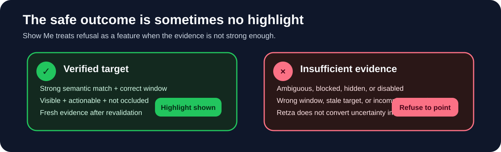

# Retza

<p align="center">
  <strong>A Windows-first desktop accessibility assistant that turns computer questions into plain-language walkthroughs and verified on-screen guidance.</strong>
</p>

<p align="center">
  <sub><strong>Retza:</strong> Reaching Everybody Through Zero Barrier Accessibility</sub>
</p>

<p align="center">
  Electron · TypeScript · Windows UI Automation · React · Gemini · Vitest
</p>

<p align="center">
  <a href="src/main/show-me/target-resolver.ts"><strong>Inspect Show Me</strong></a>
  &nbsp;·&nbsp;
  <a href="docs/ENGINEERING.md"><strong>Engineering Notes</strong></a>
  &nbsp;·&nbsp;
  <a href="https://retza-demo.vercel.app/"><strong>Browser Adaptation</strong></a>
  &nbsp;·&nbsp;
  <a href="docs/PROJECT_HISTORY.md"><strong>Project History</strong></a>
</p>

<p align="center">
  <a href="https://github.com/kzhu37/Retza-Portfolio/actions/workflows/verify.yml"></a>
</p>

<table>
  <tr>
    <td width="52%"></td>
    <td width="48%"></td>
  </tr>
  <tr>
    <td align="center"><sub><strong>Windows walkthrough:</strong> one action at a time instead of a dense answer.</sub></td>
    <td align="center"><sub><strong>Windows Show Me:</strong> highlight only after the target has been independently verified.</sub></td>
  </tr>
</table>

Retza began with a simple question: **what if computer help was designed for people who do not already understand computers?**

Direct testing exposed the deeper problem. My grandmother could understand an instruction and still scan the screen because she could not find the button or icon it described. That shifted the project from text-focused help toward guided action and eventually led to **Show Me**, a system that verifies real Windows interface elements before highlighting them.

> **Core engineering principle:** if Retza cannot confidently verify where a control is, it does not point.

The original four-person project established the user problem, direct-testing insight, and visual-guidance direction. This repository is my later Windows engineering extension. The full chronology and attribution record are in [Project history and provenance](docs/PROJECT_HISTORY.md).

## At a glance

| Area | Retza |
| --- | --- |
| **Problem** | Computer help often assumes vocabulary and interface knowledge that less experienced users do not have |
| **Key insight** | Understandable instructions can still fail when the user cannot locate the relevant control |
| **Technical centerpiece** | Fail-closed Show Me targeting through Windows UI Automation rather than model-generated coordinates |
| **Guidance strategy** | Deterministic Windows navigation for stable tasks, Gemini for broader questions, and prerequisite repair |
| **Trust model** | Model output and renderer input are validated before they can affect operating-system guidance |
| **Verification** | 103 desktop Vitest tests, 10 browser Node tests, type checking, builds, Playwright regressions, and an opt-in live Windows UIA smoke test |
| **My role** | Original phase: target-user research, testing, feedback interpretation, positioning, and communication. Later phase: Windows/Electron engineering, verified targeting, navigation, validation, testing, documentation, and browser adaptation |

**Core implementation:** [`target-resolver.ts`](src/main/show-me/target-resolver.ts) · [`windows-uia.ts`](src/main/show-me/windows-uia.ts) · [`geometry.ts`](src/main/show-me/geometry.ts) · [`assistant-response.ts`](src/main/assistant-response.ts) · [`windows-navigation.ts`](src/main/windows-navigation.ts)

## Show Me: verified visual guidance

A model can describe **what** should be located, but trusted operating-system logic decides **where** that item actually is.

<p align="center">
  
</p>

A walkthrough step can describe a semantic target:

```text
zone: ui_element
app: Settings
name: Bluetooth
role: Button
action: click
window: Settings
```

Coordinates are intentionally absent from the model-facing contract. The Electron main process validates the target, queries the live Windows accessibility tree, scores candidates, converts Windows geometry into Electron coordinates, and revalidates the target before and during display.

Candidates can be rejected when they are ambiguous, hidden, disabled, occluded, off-screen, too broad, associated with the wrong window, or stale. The matcher uses a default engineering confidence threshold of **0.78** and a **0.10 ambiguity gap**. These are defensive heuristics, not calibrated accuracy claims.

<p align="center">
  
</p>

A wrong highlight can be worse than no highlight, so Retza accepts some missed targets rather than guessing. The geometry layer also handles DPI scaling, negative monitor origins, displays above the primary monitor, controls spanning displays, and display changes while guidance is active.

For scoring, transport, geometry, stale-state validation, and lifecycle details, see [Engineering notes](docs/ENGINEERING.md).

## Testing changed the product

The retained materials document testing with my grandmother and with a teammate's younger siblings. The younger testers exposed unusual and nonsensical questions. Testing with my grandmother produced the more consequential insight: **a correct sentence is not necessarily an actionable instruction**.

Observation mattered as much as verbal feedback. A user can say an instruction makes sense while still hesitating or searching. The team also did not always agree on what counted as "simple," so observed behavior became more useful than internal consensus.

| Stage | What failed | Product response |
| --- | --- | --- |
| **Simplify the AI** | "Be simple" could still produce jargon, bundled actions, or hidden assumptions | Make prompts more explicit and separate actions |
| **Guide one action at a time** | The user could understand a step but still not find the control | Add visual guidance and later verified semantic targets |
| **Offer help proactively** | Too many interventions could become distracting or patronizing | Use bounded signals, cooldowns, and a visible Watching control |
| **Point to real controls** | Approximate or stale highlights could reduce trust | Resolve live UI elements, reject ambiguity, revalidate, and fail closed |

<p align="center">
  
</p>

The original testing was exploratory and qualitative. This repository does not claim task-completion percentages, calibrated targeting accuracy, or formal accessibility-study results that were not measured.

## Architecture and trust boundaries

<p align="center">
  
</p>

| Layer | Responsibility |
| --- | --- |
| **React renderer** | Chat, walkthroughs, settings, speech input, fox companion, and Show Me presentation |
| **Restricted preload bridge** | Narrow `contextBridge` surface exposing only required IPC operations |
| **Trusted Electron main process** | Credentials, response validation, system context, Windows navigation, prerequisites, proactive-help logic, and Show Me resolution |
| **External systems** | Gemini for broader language guidance and Windows UI Automation for live accessibility evidence |

Model output and renderer input are untrusted where they can affect operating-system guidance. Gemini responses are parsed into a bounded contract, credentials stay outside the renderer, saved keys use Electron `safeStorage` when available, and system context is deliberately limited and sanitized.

Retza also does not claim to infer emotion. Proactive help uses bounded interaction patterns such as inactivity, repeated nearby clicks, or a long hover, then applies a cooldown and leaves Watching under user control.

## Engineering decisions

| Engineering problem | Decision | Tradeoff |
| --- | --- | --- |
| Stable Windows procedures do not need generative uncertainty | Keep deterministic, version-aware navigation | Curated paths require maintenance |
| A model should not choose physical screen positions | Resolve semantic targets against live Windows UI Automation evidence | Some targets are intentionally refused |
| The OS bridge should stay bounded and inspectable | Launch fixed PowerShell UI Automation source with structured query data | Cold-start latency is higher than a warm helper |
| Correct text can still assume missing setup | Detect known prerequisite gaps and prepend repair steps | Coverage is limited to known prerequisites |
| Proactive help can become intrusive | Use conservative thresholds, cooldowns, and a visible Watching control | Some possible moments of struggle are missed |
| A browser cannot reproduce desktop privileges | Recreate the interaction model inside a sandbox | The browser adaptation cannot substitute for Windows UI Automation |

The PowerShell transport passes target text as structured data instead of interpolating it into executable source, with bounded window, node, candidate, and time limits.

## Verification

Verification is split by trust boundary so each claim maps to the evidence that actually tests it.

| Layer | Evidence |
| --- | --- |
| **Desktop Vitest** | 103 tests across six files covering response validation, Windows navigation, UIA candidate ranking, ambiguity and visibility rejection, stale state, DPI and multi-monitor geometry, duplicated taskbar controls, lifecycle behavior, and settings validation |
| **Browser Node** | 10 tests covering deterministic routing plus exact, missing, ambiguous, hidden, disabled, and unsupported semantic targets |
| **Playwright** | Validated walkthrough rendering, Show Me positioning and nested-scroll repositioning, overlapping-request race handling, text-size settings, responsive layout, reduced motion, provider-unavailable handling, and console or page errors |
| **Build and static checks** | TypeScript checking, Electron build, browser build, API syntax checks, and documentation/content checks |
| **Live Windows UIA** | Opt-in local smoke test of the real transport against the Windows taskbar, separate from default CI because hosted runners do not reproduce a normal interactive desktop session |

**Verification paths:** [`windows-uia.test.ts`](src/main/show-me/windows-uia.test.ts) · [`geometry.test.ts`](src/main/show-me/geometry.test.ts) · [`assistant-response.test.ts`](tests/assistant-response.test.ts) · [`windows-navigation.test.ts`](tests/windows-navigation.test.ts) · [`local-browser.mjs`](browser-demo/tests/local-browser.mjs)

See [Engineering notes](docs/ENGINEERING.md) for claim-to-code traceability and [Windows validation](docs/WINDOWS_VALIDATION.md) for the real-transport boundary.

## Browser adaptation and scope

The [`browser-demo`](browser-demo/) folder recreates the interaction model inside a sandbox. It can resolve semantic DOM targets and live bounds in the simulated computer, but it cannot inspect other applications, access Windows UI Automation, monitor system-wide interaction, or guide the real desktop.

Retza is **Windows-first**. Exact Show Me locating uses Windows UI Automation. macOS and Linux packaging targets exist without feature parity. Speech recognition uses English (`en-US`) when available, proactive support uses heuristics rather than emotion recognition, and the project has not undergone formal accessibility certification.

## Run locally

### Desktop

Requirements: Node.js 22.12 or newer, npm, Windows 10 or 11 for full Show Me functionality, and a Gemini API key for generative questions.

```bash
git clone https://github.com/kzhu37/Retza-Portfolio.git
cd Retza-Portfolio
npm install
npm run dev
```

Save a Gemini API key through Retza Settings, or copy `.env.example` to `.env` during development:

```env
GEMINI_API_KEY=your_key_here
RETZA_GEMINI_MODEL=gemini-2.5-flash-lite
```

### Browser adaptation

```bash
npm --prefix browser-demo run build
```

Serve `browser-demo/dist` with a local static server.

### Verify

```bash
npm run verify
npm --prefix browser-demo run verify
```

On a normal Windows desktop session:

```bash
npm run test:uia-live
```

## Engineering takeaway

Retza changed the definition of success from "the software produced a correct answer" to "the user can confidently complete the next action." Flexible systems can interpret and explain, but real on-screen guidance needs independent evidence and permission to refuse.

## Contribution and collaboration

The original four-person team was **Michael Tetelbaum, Vladimir Dukkardt, Algasem Zabarah, and Kevin Zhu**.

My documented original contribution focused on **target-user research, realistic task selection, direct testing with my grandmother, feedback interpretation, product positioning, and project communication**. Vladimir led much of the original interface and visual direction. Retained material indicates that other teammates led much of the original AI implementation, so I do not claim primary ownership of that subsystem.

The current repository is my later engineering extension. It adds the present Windows/Electron architecture, defensive Show Me targeting, deterministic navigation, bounded AI-response handling, prerequisite repair, testing and verification, engineering documentation, and the sandboxed browser adaptation. Its Git history documents this later phase, not the full chronology of the original team project.

For the full evidence trail, see [Project history and provenance](docs/PROJECT_HISTORY.md).
