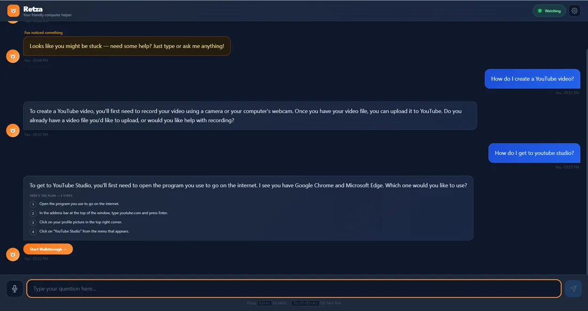
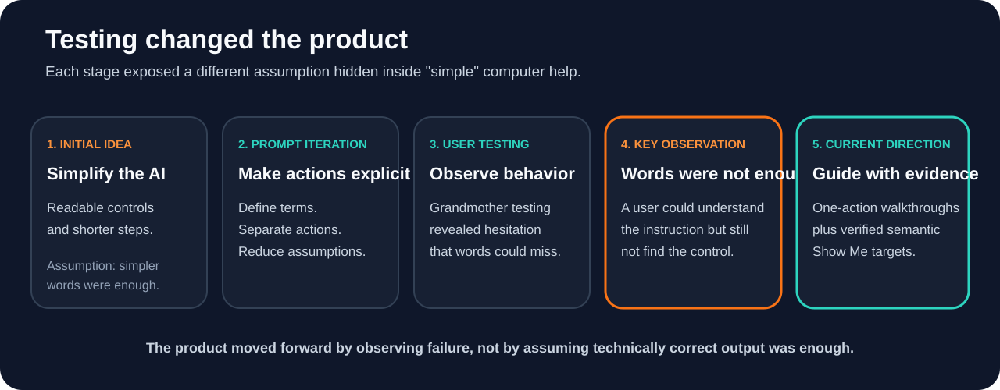
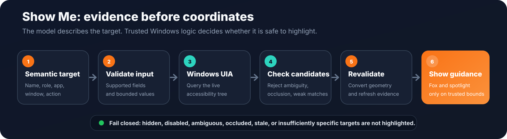
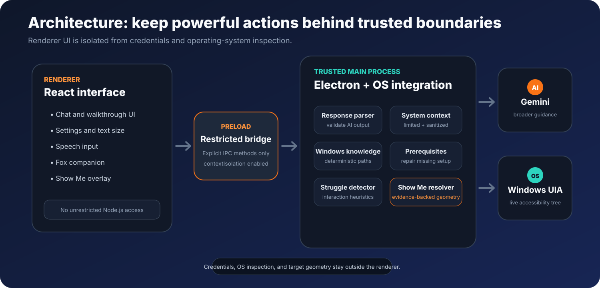
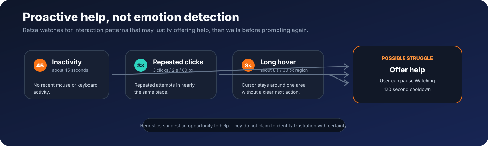

# Retza

**Reaching Everybody Through Zero Barrier Accessibility**

A Windows-first desktop accessibility assistant that turns computer questions into plain-language walkthroughs, proactive support, and verified on-screen guidance.

`Electron` · `TypeScript` · `React` · `Gemini` · `Windows UI Automation` · `Vitest`

[](https://github.com/kzhu37/Retza-Portfolio/actions/workflows/verify.yml)

<p align="center">
  <strong><a href="browser-demo/">Explore the browser adaptation</a></strong>
  &nbsp;·&nbsp;
  <a href="docs/ENGINEERING.md">Read the engineering notes</a>
</p>

<table>
  <tr>
    <td width="52%">
      
    </td>
    <td width="48%">
      
    </td>
  </tr>
  <tr>
    <td align="center"><sub><strong>Walkthrough:</strong> one action at a time instead of a dense answer.</sub></td>
    <td align="center"><sub><strong>Show Me:</strong> point only after the target has been independently verified.</sub></td>
  </tr>
</table>

Retza began with a simple question: **what if computer help was designed for people who do not already understand computers?**

The first prototype focused on patient language, large readable controls, short numbered steps, and instructions that avoided unnecessary jargon. Testing exposed a more important failure. A user could understand the instruction and still be unable to find the button or icon it described.

That observation changed the direction of the project. Retza evolved from a text-focused helper into a guided desktop companion built around actionability: one-step walkthroughs, prerequisite repair, limited system context, optional voice input, conservative proactive-help signals, and **Show Me**, a visual-guidance system that independently verifies real Windows interface elements before pointing to them.

> **Core engineering principle:** if Retza cannot confidently verify where a control is, it does not point.

<p align="center">
  <a href="#at-a-glance">At a glance</a> ·
  <a href="#testing-changed-the-product">Iteration</a> ·
  <a href="#how-show-me-works">Show Me</a> ·
  <a href="#architecture-and-trust-boundaries">Architecture</a> ·
  <a href="#testing-and-reliability">Testing</a> ·
  <a href="#browser-adaptation">Browser adaptation</a> ·
  <a href="#run-locally">Run locally</a> ·
  <a href="#contribution-and-collaboration">Contribution</a>
</p>

## At a glance

| Area | Retza |
| --- | --- |
| **Problem** | Computer help often assumes vocabulary and interface knowledge that less experienced users do not have |
| **Product** | Windows-first assistant for questions, focused walkthroughs, proactive help, and visual guidance |
| **Key product insight** | Understandable instructions can still fail when a user cannot locate the relevant control |
| **Technical centerpiece** | Fail-closed Show Me targeting through Windows UI Automation rather than model-generated coordinates |
| **Guidance strategy** | Deterministic Windows navigation for stable tasks, Gemini for broader questions, and prerequisite repair when setup steps are missing |
| **Reliability** | Windows CI runs type checking, 103 Vitest tests across six files, and a production build; browser checks add 10 focused Node tests and Playwright regression coverage |
| **Browser adaptation** | Sandboxed implementation of the core interaction model, kept separate from desktop-only privileges |

## Testing changed the product

Retza was designed for older and less experienced computer users, so the project could not be evaluated only by people who already knew where every menu and icon lived.

Testing included my grandmother, other older family members, and younger siblings within the team. Those users exposed different failure modes, but the most important observation was consistent: **correct wording did not guarantee a successful task**.

A user could read an instruction, understand the sentence, and still scan the screen looking for the control. That meant the language was clear, but the experience was not yet actionable.

| What testing exposed | What it meant | Product response |
| --- | --- | --- |
| Users could understand a sentence but still search for the button | Language clarity did not guarantee actionability | Add Show Me visual guidance |
| Short instructions could still skip knowledge the user did not have | Fewer words were not automatically clearer | Use one-action steps and prerequisite repair |
| Terms such as "settings menu" or "drag and drop" could assume prior knowledge | Familiar computer vocabulary is not universal | Prefer concrete actions and explain necessary terms |
| Proactive help could become intrusive | Support also needs user control | Use conservative thresholds, a cooldown, and a visible Watching control |
| Approximate visual guidance could reduce trust | Wrong guidance can be worse than no guidance | Resolve semantic targets and fail closed when confidence is weak |

<p align="center">
  
</p>

This became one of the main lessons of the project: a software failure does not always look like a crash. Retza could behave exactly as programmed and still fail the user if the person could not confidently complete the next action.

## What Retza does

- Converts computer questions into focused, one-action-at-a-time walkthroughs.
- Uses [deterministic Windows navigation knowledge](src/main/windows-navigation.ts) for supported tasks such as Bluetooth, Wi-Fi, display settings, sound output, Windows Update, app removal, Windows Search, and Device Manager.
- Uses Gemini for broader questions, then treats the response as untrusted input through a [bounded response parser](src/main/assistant-response.ts).
- Uses [prerequisite detection](src/main/prereq-detector.ts) to add missing setup steps when a walkthrough assumes something the user has not done yet.
- Builds a deliberately limited [system context](src/main/system-context.ts) so instructions can better match the user's environment.
- Uses **Show Me** to resolve semantic targets through Windows UI Automation rather than trusting a model to invent screen coordinates.
- Uses conservative [interaction heuristics](src/main/struggle-detector.ts) to offer help without claiming to know a user's emotional state.
- Supports speech input, adjustable text sizes, keyboard interaction, focus management, and reduced-motion behavior.

## How Show Me works

Show Me is Retza's technical centerpiece. The model can describe **what** should be located, but trusted operating-system logic decides **where** that item actually is.

<p align="center">
  
</p>

A walkthrough step can describe a semantic target such as:

```text
zone: ui_element
app: Settings
name: Bluetooth
role: Button
action: click
window: Settings
```

Coordinates are intentionally absent from the model-facing contract.

The trusted main process then:

1. validates target fields and the requested action;
2. queries the live Windows accessibility tree;
3. scores matching candidates using accessible names, Automation IDs, control roles, process and window identity, visibility, and supported interaction patterns;
4. rejects ambiguous, hidden, disabled, occluded, off-screen, or insufficiently specific candidates;
5. converts Windows physical-pixel geometry into Electron display coordinates;
6. revalidates the same target before and during display; and
7. dismisses the guide if the evidence is no longer trustworthy.

The current matcher uses a default confidence threshold of **0.78** and rejects close competing matches rather than guessing.

The geometry layer explicitly handles DPI scaling and multi-monitor layouts, including negative monitor origins, monitors positioned above the primary display, controls spanning displays, and display-layout changes while guidance is active.

For implementation detail and code references, see **[Engineering notes](docs/ENGINEERING.md)**.

## Architecture and trust boundaries

<p align="center">
  
</p>

| Layer | Responsibility |
| --- | --- |
| **React renderer** | Chat, walkthrough progress, settings, speech input, fox companion, and Show Me presentation |
| **Restricted preload bridge** | Narrow `contextBridge` surface exposing only required IPC operations |
| **Trusted Electron main process** | API credentials, response validation, context collection, Windows navigation, prerequisites, struggle detection, and Show Me resolution |
| **External systems** | Gemini for broader language guidance and Windows UI Automation for live accessibility signals |

Both model output and renderer input are treated as untrusted at boundaries where they can affect operating-system guidance.

### Defensive AI integration

Gemini responses are parsed into a bounded application contract rather than inserted directly into the interface as trusted commands. Retza validates response shape, step structure, enum values, target fields, and size limits before data reaches the walkthrough system.

The Gemini API key stays outside the renderer. Saved keys use Electron `safeStorage` when available, and the renderer only receives whether a key is configured.

### Limited system context

Retza can build a read-only view of selected system facts so instructions better match the user's environment. Depending on platform support, this can include Windows version, browser availability, selected running process names, visible browser-window titles, taskbar and Desktop shortcut names, and common email-client availability.

The context scanner does not read document contents or take screenshots for this feature. Collected strings are sanitized and treated as untrusted data before they are included in a prompt.

## Proactive help without pretending to read emotions

The original project explored whether Retza could notice when someone might be stuck without requiring them to ask for help first.

The implementation deliberately avoids claiming to infer frustration or emotion. It reacts only to bounded interaction patterns, including approximately 45 seconds of inactivity, repeated nearby clicks, or a long hover around the same area. A cooldown limits repeated interventions, and the user can pause Watching from the main interface.

<p align="center">
  
</p>

The design principle is conservative: **offer a low-cost opportunity for help, but keep control with the user.**

## Testing and reliability

Retza's verification focuses on failure states as much as successful behavior.

The Windows CI suite currently passes **103 Vitest tests across six test files** and performs TypeScript checking plus an Electron production build. Coverage includes:

- malformed and oversized AI responses;
- Windows 10 and Windows 11 navigation differences;
- ambiguous UI Automation matches;
- hidden, disabled, off-screen, and occluded controls;
- stale target and changed-window handling;
- DPI scaling and multi-monitor geometry;
- duplicated taskbar controls;
- Show Me lifecycle behavior; and
- settings validation.

The browser adaptation adds **10 focused Node tests** for semantic target resolution and deterministic scenario routing. Playwright regression checks exercise the browser experience locally, including Show Me success and failure states, revalidation, accessibility settings, responsive layout, reduced motion, secret exposure, and console or network failures.

The repository also runs a writing check that blocks forbidden long-dash characters from portfolio-facing Markdown, HTML, and text files.

Representative implementation and test files:

- [`src/main/show-me/target-resolver.ts`](src/main/show-me/target-resolver.ts)
- [`src/main/show-me/windows-uia.ts`](src/main/show-me/windows-uia.ts)
- [`src/main/show-me/geometry.ts`](src/main/show-me/geometry.ts)
- [`src/main/show-me/lifecycle.ts`](src/main/show-me/lifecycle.ts)
- [`tests/assistant-response.test.ts`](tests/assistant-response.test.ts)
- [`tests/windows-navigation.test.ts`](tests/windows-navigation.test.ts)
- [`browser-demo/tests/target-resolver.node-test.js`](browser-demo/tests/target-resolver.node-test.js)

## Browser adaptation

The [`browser-demo`](browser-demo/) folder adapts Retza's core interaction model to a sandboxed browser environment without pretending that a web page has desktop privileges.

It includes deterministic walkthroughs for Bluetooth, Wi-Fi, display settings, sound output, Windows Update, app removal, Windows Search, and Device Manager. Inside the simulated computer, Show Me resolves accessible DOM names, roles, semantic IDs, live visibility, and current element bounds. Missing, ambiguous, hidden, or disabled targets are rejected rather than guessed.

The browser version cannot inspect other applications, access the real Windows UI Automation tree, monitor system-wide interaction, or display guidance over the desktop. Those capabilities belong to the Windows application.

Broader chat is designed to use a server-side provider when one is configured. The core scenarios and Show Me behavior remain deterministic so the browser adaptation is still useful without generative AI.

This separation makes the browser version a proof of the product's interaction model and trust boundary rather than a fake reimplementation of Windows UI Automation.

## Major engineering decisions

| Challenge | Decision |
| --- | --- |
| Stable Windows tasks do not need generative uncertainty | Keep deterministic, version-aware navigation knowledge for supported topics |
| Model output may be malformed or overconfident | Parse it into a bounded contract and reject invalid targeting data |
| Correct instructions may still be unusable | Add focused walkthroughs, prerequisite repair, and Show Me |
| Wrong visual guidance can damage trust | Use semantic targeting, confidence scoring, ambiguity rejection, actionability checks, occlusion checks, and revalidation |
| Windows and Electron use different coordinate spaces | Model physical pixels, screen DIP, and overlay-local coordinates explicitly |
| Proactive help can become intrusive | Use conservative thresholds, cooldowns, and a visible user-controlled Watching mode |
| A browser cannot reproduce desktop privileges | Demonstrate the interaction model honestly inside a sandbox |

## From first prototype to current system

The original team project established the audience, simplified walkthroughs, friendly interface, and visual-guidance direction. The current showcase repository carries those ideas further with more defensive systems engineering and test coverage. The table below describes product evolution across versions, not a claim that every current capability existed in the first build.

| Earlier stage | Current repository |
| --- | --- |
| AI helper focused mainly on simplified text | Structured, context-aware walkthrough system |
| Large input and clean response area | Guided one-step flow with progress and prerequisites |
| Visual glow developed as a usability response to testing | Windows UI Automation target resolver with exact live bounds |
| Voice support discussed as a future idea | Speech input implemented |
| Detecting when a user might be stuck discussed as a future idea | Bounded inactivity, repeated-click, and long-hover heuristics |
| General AI guidance | Hybrid deterministic Windows knowledge plus Gemini |
| Approximate visual guidance concept | Confidence scoring, stale-target revalidation, DPI conversion, and multi-monitor handling |
| Limited emphasis on trust boundaries | Explicit response validation, semantic targets, credential isolation, and fail-closed guidance |

The later engineering work stays tied to the same usability problem discovered during testing rather than adding unrelated features for complexity's sake.

## Accessibility-oriented interface decisions

The current interface includes:

- Normal, Large, and Extra Large text modes;
- keyboard-operable controls and focus management;
- ARIA labels and live regions;
- voice input when Chromium speech recognition is available;
- reduced-motion behavior for Show Me;
- focused walkthrough steps instead of dense instruction blocks; and
- a visible control to pause proactive monitoring.

These are accessibility-oriented design decisions. Retza has not undergone formal WCAG certification.

## Technology stack

| Area | Technologies |
| --- | --- |
| Desktop application | Electron |
| Interface | React, TypeScript |
| Build tooling | Electron Vite, Vite |
| Generative assistance | Google Generative AI SDK |
| Windows UI locating | Windows UI Automation through PowerShell and .NET |
| Browser adaptation | HTML, CSS, JavaScript, optional server-side function |
| Interaction monitoring | `uiohook-napi` |
| Styling | Tailwind CSS and custom CSS |
| Testing | Vitest, Node test runner, Playwright |
| Packaging configuration | Electron Builder |

## Run locally

### Requirements

- Node.js 22.12 or newer and npm
- Windows 10 or Windows 11 for full Show Me functionality
- a Gemini API key for generative questions in the desktop application

### Desktop application

```bash
git clone https://github.com/kzhu37/Retza-Portfolio.git
cd Retza-Portfolio
npm install
npm run dev
```

### Configure Gemini

The easiest option is to open Retza Settings and save a Gemini API key locally.

For development, you can also copy `.env.example` to `.env`:

```env
GEMINI_API_KEY=your_key_here
RETZA_GEMINI_MODEL=gemini-2.5-flash-lite
```

Never commit a real API key.

### Browser adaptation

```bash
npm --prefix browser-demo run build
```

The static output is written to `browser-demo/dist`. Serve that directory with a local static server to exercise the deterministic walkthrough and Show Me flows.

### Verify the project

```bash
npm run verify
```

GitHub Actions extends this with browser-specific Node tests and Playwright regression checks.

## Platform scope and limitations

Retza should currently be treated as a **Windows-first** application.

- Exact Show Me locating is implemented for Windows through Windows UI Automation.
- The browser adaptation can locate only controls inside its simulated computer.
- The browser adaptation cannot inspect other applications, access the live Windows accessibility tree, monitor system-wide interaction, or render guidance over the desktop.
- Build configuration contains macOS and Linux packaging targets, but feature parity is not complete.
- Visible-window context is more complete on Windows than on macOS.
- Speech recognition currently uses English (`en-US`) when the Chromium speech API is available.
- The proactive detector uses heuristics. It can suggest that help may be useful, but it does not know a user's emotional state.
- The fox companion still includes placeholder sprite infrastructure that can later be replaced with final artwork.
- The project includes accessibility-oriented decisions but has not undergone formal WCAG certification.

These limitations stay explicit because trustworthy guidance is more important than making the system sound more capable than it is.

## Reflection

> **Building for everyone starts by noticing who gets left behind.**

Retza changed how I think about software design. A feature can work exactly as programmed and still fail the person using it. Simplifying an interface therefore means more than reducing text or buttons. It means finding the assumptions hidden inside each instruction, watching where users hesitate, and redesigning around what they actually experience.

The project also changed how I think about AI-assisted software. Flexible language is useful, but a system that guides real actions needs deterministic checks around uncertain output. Retza became strongest when generative assistance was treated as one component inside a larger engineering system rather than as the system itself.

## Contribution and collaboration

Retza began as a four-person project built by **Michael Tetelbaum, Vladimir Dukkardt, Algasem Zabarah, and Kevin Zhu**. Because the project was collaborative, the most useful ownership description is specific rather than broad.

My original role centered on **target-user framing, use-case selection, direct testing, feedback interpretation, product positioning, and project communication**. I focused on the audience, the kinds of computer tasks older users might struggle with, and how the product should be explained as something practical rather than as a generic chatbot. I tested Retza with my grandmother and helped turn observed difficulty into product direction, especially the realization that understanding an instruction is not the same as being able to act on it.

| Area | Contribution boundary |
| --- | --- |
| **Target-user framing and task selection** | I focused on the audience, common pain points, example questions, and realistic testing scenarios |
| **Direct testing and feedback synthesis** | I tested with my grandmother and helped interpret search behavior and hesitation as usability evidence |
| **Product positioning and communication** | I helped define what "zero barrier" should mean in practice and helped shape how the problem and solution were presented |
| **AI behavior and response generation** | Michael Tetelbaum and Algasem Zabarah focused more heavily on this area; broader iteration was collaborative |
| **Interface and visual direction** | Vladimir Dukkardt led much of the interface design and product look |
| **Overall project** | Product decisions, iteration, testing, and final presentation were collaborative across the team |

The current public repository was prepared later as a showcase version of the project and extends the original concept with additional engineering, testing, documentation, and a browser adaptation. Its Git history therefore does not represent the full chronology of the original team development.
