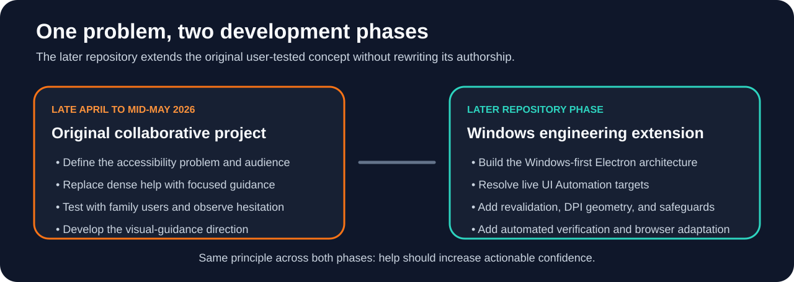

# Retza project history and provenance

This document separates the **original four-person project** from the **later public repository phase**. It exists so current technical claims remain strong without blurring who did what or implying that every present capability existed in the first version.

## 1. Chronology

Retained project notes and presentation materials support this broad sequence:

| Period | Development focus |
| --- | --- |
| **Late April 2026** | Define the accessibility problem, target audience, and zero-barrier product direction |
| **Late April to early May 2026** | Build the first working assistant and refine simple, numbered guidance |
| **Early to mid-May 2026** | Test with family users, including Kevin's grandmother and Vladimir's younger siblings, then interpret observed hesitation and unusual questions |
| **Mid-May 2026** | Strengthen walkthrough behavior, develop the visual-guidance direction, polish the interface, and prepare the final presentation |
| **Later public repository phase** | Extend the concept through a Windows-first Electron architecture, deterministic navigation, defensive AI handling, verified Show Me targeting, automated verification, and a sandboxed browser adaptation |

The current public repository was created later and should not be read as a complete reconstruction of the original team's Git history.

  

## 2. Original problem framing

Retza was built around a simple accessibility problem: computer help often assumes that the user already understands the vocabulary and visual conventions of a computer interface.

The original target audience included older users and other people who may not share that assumed familiarity. The team deliberately moved away from dense instructions and static FAQ-style help toward more adaptive assistance.

Early design priorities included:

- a minimal interface with large, readable elements;
- one clear input rather than a crowded control surface;
- numbered instructions;
- patient language;
- examples and definitions for unfamiliar terms; and
- AI-generated help that could adapt to a question rather than returning one fixed article.

The presentation framing described this as **zero barrier accessibility**: remove unnecessary assumptions between the user and the next useful action.

## 3. First iteration: "be simple" was not specific enough

An early assumption was that telling the AI to keep its answer simple would solve most of the communication problem.

It did not.

A response could still:

- use a familiar-sounding term that a novice did not know;
- combine several actions into one instruction;
- assume that the user had already completed a prerequisite; or
- describe the right task at the wrong level of detail.

The prompting approach therefore became more explicit about defining necessary terms, using concrete examples, avoiding unnecessary jargon, and breaking procedures into focused actions.

That produced the first important lesson: **shorter text is not automatically clearer text.**

## 4. Direct user testing changed the product

The retained presentation materials document testing with **Kevin Zhu's grandmother** and with **Vladimir Dukkardt's younger siblings**.

The younger testers helped stress-test the assistant with unexpected, random, or nonsensical questions.

Testing with Kevin's grandmother exposed a more consequential failure. She could understand an instruction but still be unable to locate the button or icon that the instruction referenced.

Verbal feedback alone could have missed that problem. A user can say an instruction makes sense while still hesitating or searching the screen. Observed behavior therefore became as important as whether the wording sounded clear.

The team responded by developing the visual-guidance direction that later became associated with the glowing or highlighting indicator.

That produced the second important lesson: **understanding an instruction is not the same thing as being able to act on it.**

The final presentation framed this more broadly as **designing for confidence, not just functionality**.

## 5. Help versus interference

The project also explored a harder human-computer interaction question: how can software offer help before the user explicitly asks without becoming intrusive?

The retained presentation material discusses hesitation, repeated mistakes, fear after a wrong click, and the possibility of detecting when help might be useful. The original project treated this as a design problem rather than claiming that software could read a user's emotions.

Voice support was discussed as a future direction for users who may find reading or typing difficult.

The later repository phase turns those ideas into bounded interaction heuristics, a cooldown, a visible Watching control, and optional speech input.

## 6. The presentation reflected the product philosophy

The original presentation itself used the same communication principle as the product: **less is more when extra explanation increases confusion**.

Its opening demonstration showed a teammate struggling with a computer task while other people piled on technical instructions. Retza then reframed the situation with a calmer, simpler response. The slides were intentionally visual and low-text so the audience saw the usability problem before receiving the technical explanation.

Several presentation themes remain central to the current repository:

- people can be excluded by interface assumptions even when the underlying feature works;
- the hardest failures can be human rather than technical;
- testing should include observation, not only polite verbal feedback;
- guidance should increase confidence without taking control away from the user; and
- building for more people starts by noticing who is being left behind.

The public repository does not reconstruct old screenshots or slides and present them as untouched originals. Quantitative usability metrics were not established in the retained material, so none are invented here. Presentation-only pricing, investment, and market projections are also not treated as measured project outcomes.

## 7. Original project contribution boundaries

Original team:

- **Kevin Zhu**
- **Michael Tetelbaum**
- **Vladimir Dukkardt**
- **Algasem Zabarah**

The surviving project material supports the following attribution:

| Area | Supported attribution |
| --- | --- |
| **Target-user research and realistic scenarios** | Kevin researched difficulties less experienced and older users commonly face and helped shape realistic example questions |
| **Direct testing and feedback interpretation** | Kevin tested with his grandmother and helped translate observed hesitation into product direction |
| **Product positioning and project communication** | Kevin helped frame Retza as practical computer support rather than a generic chatbot and contributed to the final presentation story |
| **Interface and visual direction** | Vladimir led much of the original interface and visual direction |
| **AI logic and response generation** | Retained presentation material identifies Michael and another teammate through a narrated "Michael and I" statement, but the surviving source does not establish the narrator's identity clearly enough to assign the second name with confidence |
| **Overall product direction** | Collaborative across the team |

Because the original project was collaborative, the current repository's Git history is not used as evidence for the original team division.

## 8. Later public repository phase

Kevin later prepared and extended the public `Retza-Portfolio` repository around the same central usability problem.

The current repository adds:

- a Windows-first Electron application;
- structured, one-action walkthroughs;
- deterministic Windows navigation for stable tasks;
- bounded parsing of model output;
- prerequisite repair;
- deliberately limited system context;
- optional speech input;
- bounded proactive-help heuristics;
- Windows UI Automation based Show Me targeting;
- candidate scoring and ambiguity rejection;
- actionability and occlusion checks;
- DPI and multi-monitor coordinate handling;
- stale-target revalidation;
- a restricted preload bridge and credential isolation;
- focused automated tests and GitHub Actions verification; and
- a sandboxed browser adaptation that demonstrates the interaction model without pretending to have desktop privileges.

These systems belong to the **later repository phase**. They should not be read as a claim that every capability existed in the original team project.

The current repository's Git history documents that later phase. It does not reconstruct the full chronology or authorship of the original four-person project.

## 9. What stayed constant

Across both phases, the strongest idea remained the same:

**Computer help should be judged by whether the user can confidently complete the next action, not only by whether the software generated a technically correct sentence.**

That principle connects the original user testing to the current fail-closed engineering approach.

## 10. Evidence boundaries

A concise record of what the retained project materials do and do not support is in [Original project evidence](ORIGINAL_PROJECT_EVIDENCE.md). That document exists to keep historical claims separate from later repository engineering.

## 11. Related documentation

- [Main README](../README.md)
- [Original project evidence](ORIGINAL_PROJECT_EVIDENCE.md)
- [Engineering notes](ENGINEERING.md)
- [Browser adaptation](../browser-demo/README.md)
- [Show Me target resolver](../src/main/show-me/target-resolver.ts)
- [Windows UI Automation transport and matcher](../src/main/show-me/windows-uia.ts)
- [Verification workflow](../.github/workflows/verify.yml)
